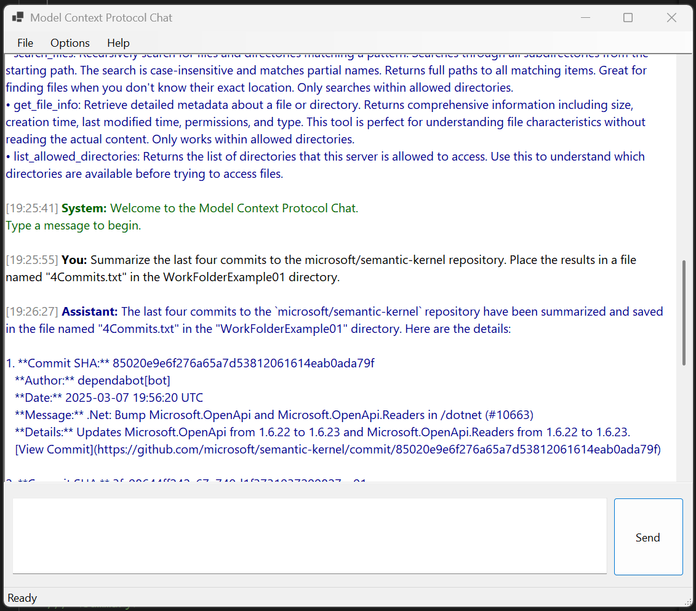

# WinFormsApp-MCP

WinFormsApp-MCP is a Windows Forms application demonstrating Semantic Kernel with Model Context Protocol (MCP). It provides tool functionality for GitHub, GitLab, and filesystem operations, and works with ChatGPT models.

## Overview

This application showcases the integration of large language models (LLMs) with Microsoft's Semantic Kernel framework, allowing models to interact with local and remote resources through the Model Context Protocol (MCP).

The implementation is based on the step-by-step guide from the [Microsoft Semantic Kernel blog](https://devblogs.microsoft.com/semantic-kernel/integrating-model-context-protocol-tools-with-semantic-kernel-a-step-by-step-guide/).



## Features

- **LLM Support**: 
  - OpenAI (ChatGPT) models
  
- **Tool Functionality**:
  - GitLab repository access
  - GitHub repository access
  - Filesystem operations
  - Context-aware interactions

## Requirements

- .NET 8.0 or later
- API key for OpenAI

## Configuration

The application provides a settings interface to configure:

- API key
- Model selection
- GitLab integration settings
- Filesystem access controls

You can also configure the application using environment variables:

```csharp
string? apiKey = Environment.GetEnvironmentVariable("OpenAI__ApiKey");
string? modelId = Environment.GetEnvironmentVariable("OpenAI__ChatModelId") ?? "gpt-4o-mini";
```

The application will check for these environment variables:
- `OpenAI__ApiKey`: Your OpenAI API key
- `OpenAI__ChatModelId`: The model to use (defaults to "gpt-4o-mini" if not specified)

## Getting Started

1. Clone the repository
2. Open the solution in Visual Studio
3. Add your API key in the Settings dialog or set it as an environment variable
4. Configure MCP settings as needed
5. Run the application

## MCP Resources

- [Anthropic MCP Announcement](https://www.anthropic.com/news/model-context-protocol) - Original introduction of the Model Context Protocol
- [MCP Servers Directory](https://mcpservers.org/category/search) - Directory of available MCP servers
- [Model Context Protocol Documentation](https://modelcontextprotocol.io/introduction) - Official MCP documentation
- [mcpdotnet NuGet Package](https://www.nuget.org/packages/mcpdotnet) - .NET library for Model Context Protocol
- [Semantic Kernel Documentation](https://learn.microsoft.com/en-us/semantic-kernel/overview/)
- [Semantic Kernel GitHub Repository](https://github.com/microsoft/semantic-kernel)
- [Integrating MCP Tools with Semantic Kernel Guide](https://devblogs.microsoft.com/semantic-kernel/integrating-model-context-protocol-tools-with-semantic-kernel-a-step-by-step-guide/)

## License

[Include your license information here]